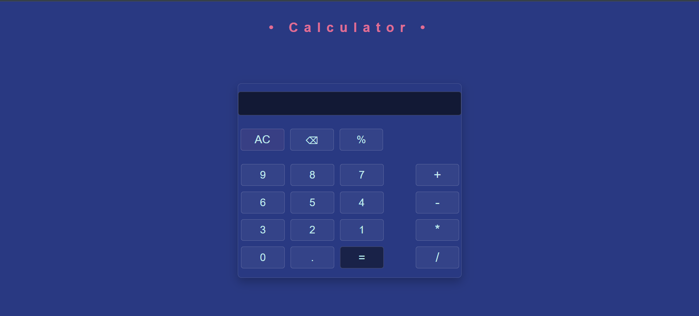

# Calculator

This project focuses on practicing JavaScript fundamentals, DOM manipulation, event handling, and CSS layout/styling.

## Features

- Basic arithmetic operations:
  - Addition
  - Subtraction
  - Multiplication
  - Division
- Percentage calculations
- Decimal number input
- Backspace functionality
- Clear (`AC`) button
- Keyboard support
- Division-by-zero handling
- Result rounding
- Hover and active button effects
- Responsive button layout using Flexbox

## Built With

- HTML
- CSS
- JavaScript

## What I Practiced

- JavaScript functions and variables
- DOM selection and manipulation
- Event listeners
- Keyboard events
- Array methods
- Conditional logic
- Type conversion
- CSS Flexbox
- CSS transitions and pseudo-classes
- Git and GitHub workflow

## How to Use

1. Enter numbers using the calculator buttons or keyboard.
2. Choose an operator.
3. Enter the second number.
4. Press `=` or `Enter` to calculate.
5. Use `AC` to clear the calculator.
6. Use `⌫` to remove the last entered character.

